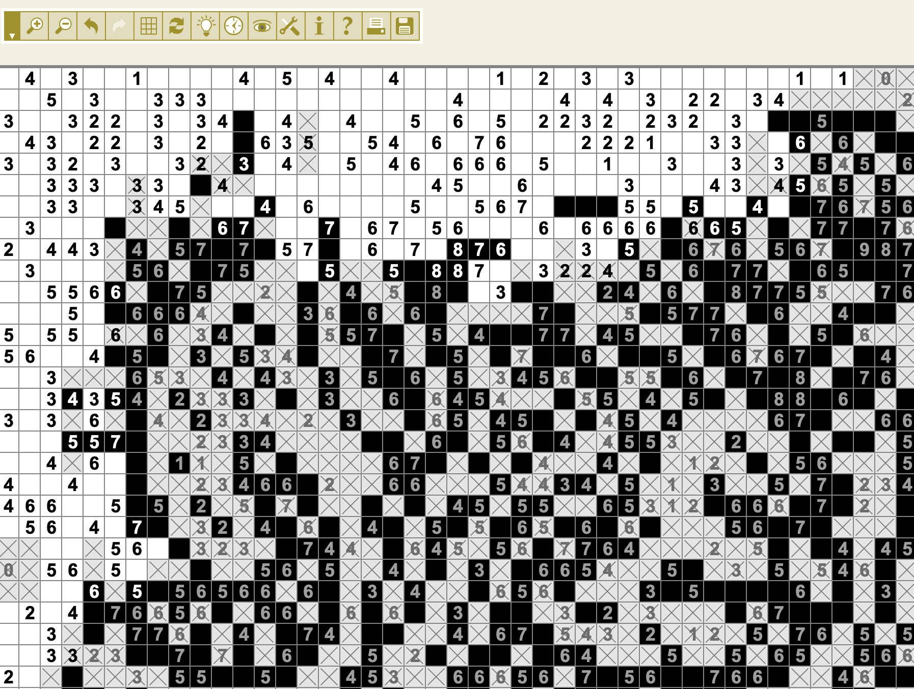
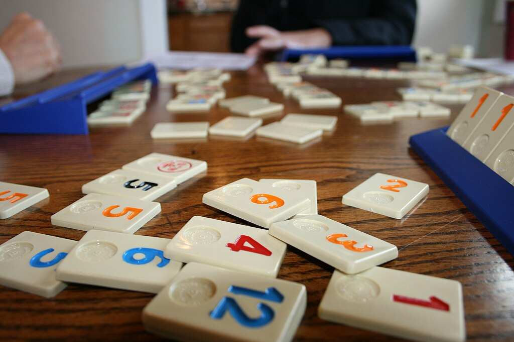
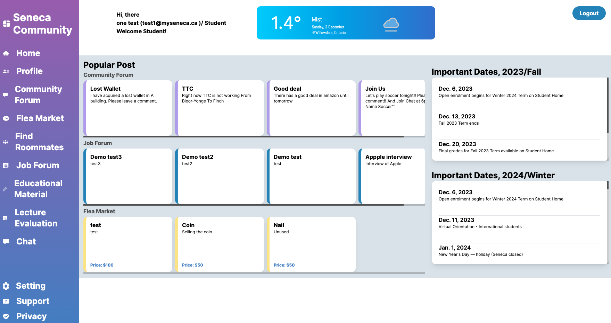

  

# Hello! I'm Yujin Kim!
I'm a software engineer with a background in math tutoring. I'm used to understanding theories and concepts logically and applying them in practice. I'm interested and passionate about developing helpful software that I can use in real life.

# About me

I am a software developer who enjoys puzzles and music. I love all kinds of math puzzles, like Fill-A-Pix, Sudoku, and Rummikub. Even with puzzles that I've never done before, I like to try new things while learning how to do them. In Korea, I also regularly performed on the streets or in concert venues with my friends. Especially, I like to harmonize, and I like to sing with acoustic accompaniment.

    
    
    

## 🌐 My Socials:

## 💡 Projects:

<table bordercolor="#66b2b2" width="100%">
    <tr valign="top">
        <td width="50%" align="center">
            <h3>Seneca Community</h3>
        </td>
    </tr>
    <tr valign="center">
        <td width="50%" align="center">
            
        </td>
    </tr>
    <tr valign="top">
        <td width="50%">
            

                <strong>Stack:</strong> React, ExpressJS, MySql, MongoDB, Mongoose, BcryptJS, Tailwind, Vercel, Cheerio, Dotenv, Husky, Axios, Reduct, Figma
            

        </td>
    </tr>
    <tr valign="top">
        <td width="50%">
            

                SenecaCommunity is a unified platform that seamlessly integrates student collaboration, academic resources, and real-time communication within Seneca's educational community. Designed to enhance learning efficiency and community engagement, it serves students, faculty, and staff by centralizing information and fostering an environment of active participation and cooperation.
            

        </td>
    </tr>
</table>

## 💻 Tech Stack:

- Working Knowledge: JavaScript, TypeScript, C++, React, NextJS, NodeJs, Git, SQL, ExpressJS, CSS

- Exposed: Python, C, C#, Java, mySQL, MongoDB, Oracle 12c, Docker, AWS, Azure, BootStrap, Tailwind, Jotai, Swift

## 📊 GitHub Stats:

    

    

## 📝 LeetCode Stats:

    

  

