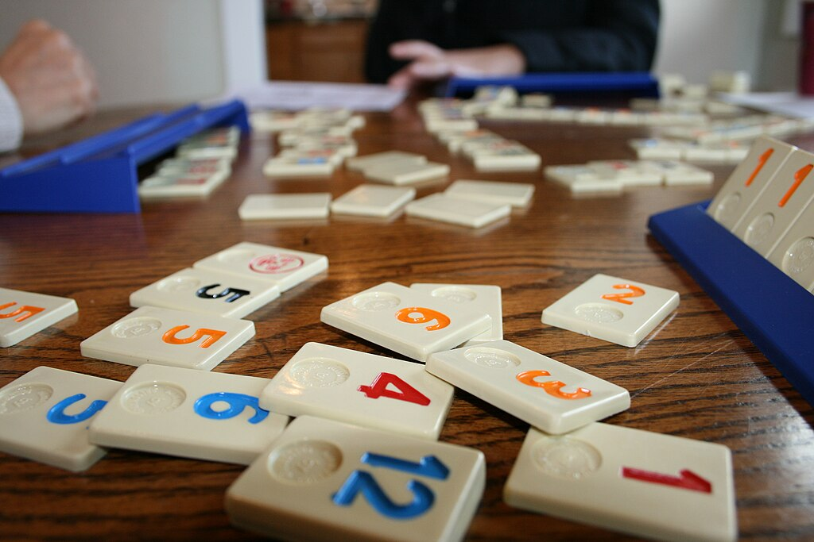
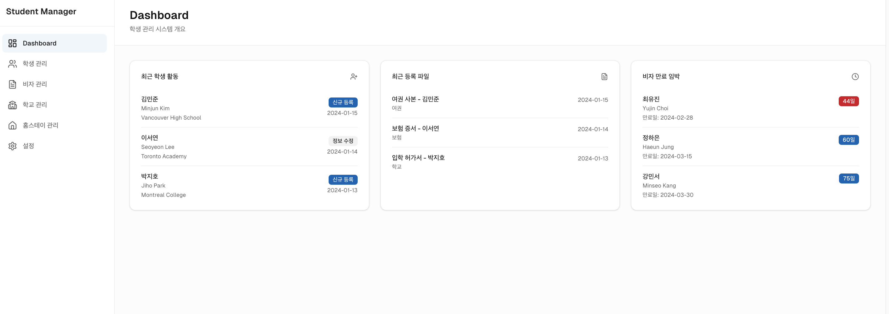
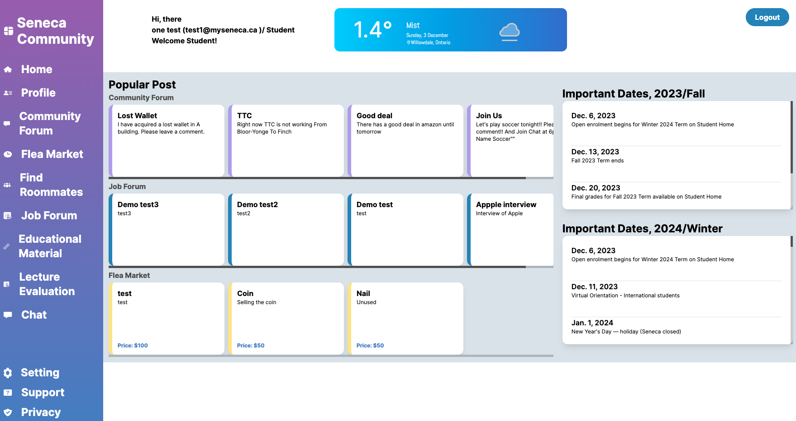

  

# Hello! I'm Yujin Kim!
I'm a software engineer with a background in math tutoring. I'm used to understanding theories and concepts logically and applying them in practice. I'm interested and passionate about developing helpful software that I can use in real life.

# About me

I am a software developer who enjoys puzzles and music. I love all kinds of math puzzles, like Fill-A-Pix, Sudoku, and Rummikub. Even with puzzles that I've never done before, I like to try new things while learning how to do them. In Korea, I also regularly performed on the streets or in concert venues with my friends. Especially, I like to harmonize, and I like to sing with acoustic accompaniment.

    
    
    

## 💡 Projects:

<table bordercolor="#66b2b2" width="100%">
    <tr valign="top">
        <td width="50%" align="center">
            <h3>TBC Student Manager</h3>
        </td>
    </tr>
    <tr valign="center">
        <td width="50%" align="center">
          
        </td>
    </tr>
    <tr valign="top">
        <td width="50%">
            

                 <strong>Stack:</strong> React, TypeScript, Vite, Tailwind CSS, Express.js, PostgreSQL (Supabase), Drizzle ORM, Supabase Auth, AWS S3, Fly.io, GitHub Actions
            

        </td>
    </tr>
    <tr valign="top">
        <td width="50%">
            

                TBC Student Manager is a full-stack web application built for an education consulting agency to centralize student operations end-to-end. It streamlines student onboarding, program tracking, document management, and internal coordination by organizing key data in one place and reducing manual, error-prone workflows.
        Designed for day-to-day use by admins and staff, the system improves visibility across student records and enables faster, more consistent processing through structured data, role-based access, and secure file handling.
      

          

        <em>Note: All data shown in the screenshots is sample/test data for demonstration purposes.</em>
      

    </td>
            

        </td>
    </tr>
</table>

<table bordercolor="#66b2b2" width="100%">
    <tr valign="top">
        <td width="50%" align="center">
            <h3>Seneca Community</h3>
            <a href="https://github.com/ykim7/Grad_project_team2">link</a>
        </td>
    </tr>
    <tr valign="center">
        <td width="50%" align="center">
            
        </td>
    </tr>
    <tr valign="top">
        <td width="50%">
            

                <strong>Stack:</strong> React, ExpressJS, MySql, MongoDB, Mongoose, BcryptJS, Tailwind, Vercel, Cheerio, Dotenv, Husky, Axios, Reduct, Figma
            

        </td>
    </tr>
    <tr valign="top">
        <td width="50%">
            

                SenecaCommunity is a unified platform that seamlessly integrates student collaboration, academic resources, and real-time communication within Seneca's educational community. Designed to enhance learning efficiency and community engagement, it serves students, faculty, and staff by centralizing information and fostering an environment of active participation and cooperation.
            

        </td>
    </tr>
</table>

## 💻 Tech Stack:

- Working Knowledge: TypeScript, Python, React, Next.js, Node.js, Express.js, Docker, Vite, AWS, Git, PostgreSQL

- Exposed: C, C#, Java, Flutter, MySQL, MongoDB, GraphQL, Azure, Bootstrap, Tailwind CSS, Swift, GCP, FastAPI

## 📝 LeetCode Stats:

    

  

